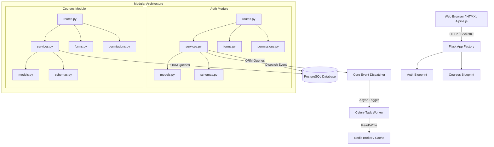

# CampusOS 2.0 Architecture

## 1. Modular Monolith Overview

CampusOS 2.0 is designed as a **Modular Monolith** to balance rapid development velocity, simplicity of deployment, and high logical separation of domain boundaries. 

The application is structured into decoupled domain packages inside the `app/modules/` directory. Each module operates as a self-contained feature unit, exposing a strict internal API through its service layer and communicating with other modules asynchronously or via a lightweight internal Event Dispatcher.



---

## 2. Directory Layout and Module Structure

Every major domain module must conform to the following directory structure:

```
app/modules/<module_name>/
├── __init__.py         # Module initialization & Blueprint definition
├── models.py           # SQLAlchemy database models
├── schemas.py          # Pydantic or Marshmallow validation/serialization schemas
├── services.py         # Pure business logic layer
├── routes.py           # HTTP/SocketIO endpoints (Blueprints)
├── forms.py            # WTForms definitions for Flask/Jinja template rendering
└── permissions.py      # Role-Based Access Control (RBAC) and permissions check logic
```

### 2.1 File Responsibilities

| File | Responsibility | Rules |
| :--- | :--- | :--- |
| **`models.py`** | Database schema definition using Flask-SQLAlchemy. | No business logic. Standard attributes and database relationships only. |
| **`schemas.py`** | Serialization and deserialization schemas (using Pydantic/Marshmallow). | Used to format output for JSON APIs and validate payloads. |
| **`services.py`** | **Single Source of Truth** for all business rules and database mutations. | Routes must execute logic *only* by calling services. Fully testable without running an HTTP server. |
| **`routes.py`** | Blueprint route definitions, handling request parsing and response rendering. | **No business logic allowed.** They validate inputs (via WTForms/schemas), call services, and return HTML (Jinja2/HTMX) or JSON. |
| **`forms.py`** | Form classes for input validation in web templates. | Uses standard WTForms validators. |
| **`permissions.py`** | Role-Based Access Control (RBAC) decorators and utility checks. | Ensures that only permitted users (Student, Teacher, Admin) can perform operations. |

---

## 3. Core Architectural Patterns

### 3.1 Service Layer Pattern
All business operations reside within service classes (e.g., `AuthService`, `CourseService`). Services accept native Python types, models, or DTOs, perform operations (e.g., validating business rules, sending events, persisting state), and return result objects or models. 

### 3.2 Event-Driven Communication
To maintain loose coupling, modules must not import service classes of other modules directly if it introduces circular dependencies or tight logical coupling. Instead, modules publish events to the `Core Event Dispatcher` (e.g., `USER_REGISTERED`, `ATTENDANCE_STARTED`). 
Other modules register synchronous event listeners, or tasks are delegated asynchronously to **Celery** workers.

### 3.3 Database Access (Repository Pattern Support)
SQLAlchemy models are queried either directly in the Service layer or through dedicated Repository helper functions where queries are complex and require reusability (e.g., eager loading, filter compositions).

---

## 4. Technology Stack & Integration

- **Backend**: Python, Flask, Flask-SQLAlchemy (ORM), Flask-Login (session auth), Flask-Migrate (Alembic migrations).
- **Asynchronous Task Queue**: Celery with Redis as both broker and backend.
- **Frontend Stack**:
  - **Jinja2**: Server-side template rendering for fast first-paint.
  - **HTMX**: Handles dynamic AJAX-like updates (partial DOM swaps) without full page reloads.
  - **Alpine.js**: Manages local client-side interactive state (modals, dropdowns, basic transitions).
  - **TailwindCSS**: Utilitarian CSS framework injected via standard build processes.
- **Database**: PostgreSQL for robust relation tracking and transactional safety.
- **Development/Deployment**: Docker containerization (`web`, `celery_worker`, `postgres`, `redis`).
